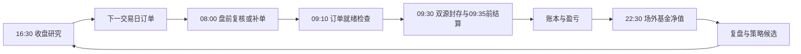

<p align="center">
  
</p>

<p align="center">
  
  
  
  
  
</p>

<p align="center">
  <a href="#现在赚了还是亏了">实验账本</a> ·
  <a href="#当前市场判断">市场判断</a> ·
  <a href="#我怎么买又为什么卖">买卖逻辑</a> ·
  <a href="#未来五个交易日怎么做">近期计划</a> ·
  <a href="#每天如何运行">自动化</a>
</p>

> [!WARNING]
> **Vibe Finance 是纯虚拟投资实验，不连接券商、基金销售平台、银行或支付系统。仓库中的持仓、订单、收益和观点均为模拟记录，不构成任何投资建议，也不代表未来收益。请勿据此进行真实交易。**

# 这是什么？

Vibe Finance 给一个金融 Agent 30,000 元虚拟本金，让它只研究中国大陆公开可查的 A 股、场内 ETF 和公募基金。Agent 每天保存当时能看到的数据，形成虚拟订单，按后续可验证价格结算，再用实际模拟盈亏检验自己的判断。

实验目标很直接：在承担明确风险和交易成本的前提下，让虚拟本金增长。收益是第一评价指标，回撤、费用和错误订单用于解释收益从哪里来、又在哪里损失。

## 现在赚了还是亏了？

<!-- VIBE_STATUS:START -->
### 公开实验账本

> 数据截点：`2026-07-23T09:35:00+08:00`。状态由 `data/ledger/portfolio.json` 生成；所有金额均为虚拟记录。

| 指标 | 当前值 |
|---|---:|
| 初始项目资本 | ¥30,000.00 |
| 累计买入金额 | ¥7,871.60 |
| 当前持仓市值 | ¥8,030.80 |
| 可投资现金 | ¥22,018.40 |
| 累计交易费用 | ¥10.00 |
| DeepSeek 已用预算 | ¥0.000000 |
| 项目总权益 | ¥30,149.20 |
| 累计盈亏 | **盈利 +149.20 元（+0.50%）** |
| 已成交笔数 | 2 |
| 待执行订单 | 0 |

#### 当前持仓

| 代码 | 标的 | 数量 | 平均成本 | 最近估值 | 市值 | 未实现盈亏（元） |
|---|---|---:|---:|---:|---:|---:|
| 510300 | 华泰柏瑞沪深300ETF | 1200 | ¥4.6812 | ¥4.7650 | ¥5,718.00 | +100.60 |
| 512100 | 南方中证1000ETF | 800 | ¥2.8302 | ¥2.8910 | ¥2,312.80 | +48.60 |

<!-- VIBE_STATUS:END -->

完整账本见 [`data/ledger/portfolio.json`](data/ledger/portfolio.json)，逐笔订单见 [`data/ledger/orders.jsonl`](data/ledger/orders.jsonl)。历史报告不会被后续结果改写。

<!-- VIBE_DAILY_STRATEGY:START -->
## 当前市场判断

> 每日策略日期：**2026-07-23**；决策截点：`2026-07-23T08:00:00+08:00`；报告策略 SHA `8bd96245c815`；当前配置为 `v0.3.1`，已在该决策截点后变化。本区块由最新不可变报告自动生成，不再保留首日静态策略。

### 市场温度

行情观测截至 `2026-07-22T15:35:40+08:00`。

| 指数 | 当日涨跌 |
|---|---:|
| 上证指数 | +0.07% |
| 深证成指 | -1.42% |
| 创业板指 | -3.23% |
| 沪深300 | -0.46% |
| 中证500 | -0.63% |

**结论：广泛市场冲击门已触发。新增权益买入暂停，先保护组合并核验防御资产。**

点时输入：[`2026-07-23-preopen.json`](data/inbox/2026-07-23-preopen.json)。

### 今日策略动作

| 代码 | 标的 | 动作 | 当前权重 | 主要依据 |
|---|---|---:|---:|---|
| 510300 | 华泰柏瑞沪深300ETF | 持有 | 19.0% | 历史仍处于冷启动；市场冲击下暂停新增权益；盘前交易状态待核验 |
| 512100 | 南方中证1000ETF | 持有 | 7.7% | 历史仍处于冷启动；市场冲击下暂停新增权益；盘前交易状态待核验 |
| 510050 | 华夏上证50ETF | 观察 | 0.0% | 历史仍处于冷启动；市场冲击下暂停新增权益；盘前交易状态待核验 |
| 512170 | 华宝中证医疗ETF | 观察 | 0.0% | 历史仍处于冷启动；市场冲击下暂停新增权益；盘前交易状态待核验 |

决策报告：[`2026-07-23-preopen.json`](reports/preopen/2026-07-23-preopen.json)。

### 今日执行与订单

- 开盘结算截点：`2026-07-23T09:35:00+08:00`；实际虚拟成交 **0** 笔，取消 **1** 笔。
- `CANCELLED_DATA_GATE` 卖出 `510300` 100 份；原因：`UNVERIFIED_TIMELY_OPEN_SNAPSHOT`。
- 执行报告：[`2026-07-23-open.json`](reports/execution/2026-07-23-open.json)。
- 当前账本待执行订单：**0** 笔。

### 场外基金周期

- 最新净值周期：**2026-07-22** `2026-07-22T22:37:15+08:00`；扫描 7 只场外基金，可执行信号 0 个。
- 天天基金只作净值、申赎、费率等交叉检查；详情见 [`2026-07-22-funds.json`](reports/funds/2026-07-22-funds.json)。
- 今日 22:30 基金净值周期尚未产出；不会把上一交易日净值冒充今日结果。

<!-- VIBE_DAILY_STRATEGY:END -->

## 我怎么买，又为什么卖？

系统同时运行四套规则。它们共享资金、费用和组合上限，但不会把不同市场状态压成同一个信号。

### 1. 趋势延续

价格位于中期均线之上，短期均线没有转弱，且当日涨幅没有进入追高区间时，系统可以买入相对强势资产。冷启动阶段没有完整20日历史，只允许宽基或高流动性场内 ETF 以受限仓位参与。

### 2. 受控回撤买入

下跌本身不是买入理由。回撤买入要求：跌幅落在预设区间、市场没有进入广泛冲击、标的不存在停牌或未处理公司行为，完整历史可用时还要求价格没有严重偏离中期趋势。首笔仓位小于趋势仓位，后续只有在数据继续支持时才加仓。

### 3. 防御与分散

黄金、债券和现金管理工具使用自己的波动与趋势条件。它们用于控制组合暴露，不会因为“看起来安全”自动获得仓位。

### 4. 每日小额探索

如果正常交易日没有趋势、回撤或退出信号，系统会在可验证价格、现金和仓位上限允许时，对优先级最高的场内 ETF 进行小额探索。若组合已经达到上限，则减持一个可卖出的最小交易单位。这个规则满足每日实验要求，同时把最低佣金造成的损耗完整计入账本。

### 卖出规则

- 中期趋势失效时退出，不因为已经亏损而拖延确认错误。
- 单一资产或风险桶超过上限时减仓。
- 数据冲突、停牌、未处理分红拆分或基金申赎异常时取消订单。
- A股和股票ETF遵守 T+1 约束；同日买入份额不会被系统当日卖出。

“追涨”和“抄底”都只是条件化策略。趋势仓位买强不追极端高开，回撤仓位买跌但拒绝接连续失速的下跌。

## 股票与基金：哪些相同，哪些不同？

| 维度 | 股票 / 场内ETF | 场外公募基金 |
|---|---|---|
| 共同规则 | 资金上限、相关性、风险桶、费用、回撤和证据截点 | 同左 |
| 价格 | 交易所价格，至少双源核对 | 基金公司确认净值，并由天天基金交叉检查 |
| 成交 | 盘前或收盘形成订单，后续开盘结算 | 先登记 `PENDING_NEXT_NAV`，等待信号日之后的确认净值 |
| 额外门禁 | ST/退市、停牌、财报、公司行为、流动性 | 申购赎回、份额类别、费率、规模、经理、持仓披露和风格漂移 |

天天基金用于发现基金线索和交叉检查净值、申赎、费率、规模、经理、持仓与公告。关键事实仍回到基金公司、交易所或法定披露。排行榜不能单独触发买入。

<!-- VIBE_DAILY_PLAN:START -->
## 未来五个交易日怎么做？

> 这是依据 **2026-07-23** 最新证据生成的滚动计划；下一次 `update-readme` 会整体替换本区块，历史判断仍保留在不可变日报中。

| 阶段 | 计划 | 判定条件 |
|---|---|---|
| 本交易日后续 | 16:30 保存权益、黄金、国债和现金 ETF 的完整收盘截面并重新计算订单 | 数据类型齐全、双源一致、公司行为已核验 |
| 下一交易日 | 先复核市场冲击是否解除；未解除时不新增权益仓，优先核验现金、国债与黄金 ETF 的完整数据。 | 广泛冲击门、开盘时间窗、价格冲突与 T+1 |
| 第 2–3 个交易日 | 比较 510300 与 512100 的相对强弱；趋势失效则减仓，冲击解除后才允许受控回撤或趋势加仓 | 组合回撤、MA20、日收益区间、风险桶占用 |
| 第 3–4 个交易日 | 用天天基金与基金公司复核场外指数、债券、黄金和现金管理基金；未知净值只登记、不假成交 | 净值日期、申赎、费率、规模与双源 |
| 第 5 个交易日 | 归因趋势、回撤、防御与取消订单的贡献，只提出可证伪策略候选 | 净收益、费用、最大回撤、取消率与样本外门禁 |

所有订单和计划均为虚拟实验，不构成投资建议。

<!-- VIBE_DAILY_PLAN:END -->

## 组合边界

当前策略允许最多6个持仓，每轮最多2笔新买入；单只场内ETF不超过20%，权益总暴露不超过70%，现金至少保留10%。同一经济暴露只保留一个工具，避免把沪深300ETF和沪深300联接基金误算成两份分散。

每日交易是实验约束，不是收益保证。休市、停牌、涨跌停、价格无法交叉验证或自动化故障时，系统会把当天标记为失败，不会编造一笔成交。

## 每天如何运行？



| 北京时间 | 任务 |
|---|---|
| 工作日 08:00 | 检查隔夜公告，生成或修正当日盘前虚拟订单 |
| 工作日 09:10 | 确认至少存在一笔可结算订单；缺失时执行小额探索补单 |
| 工作日 09:30–09:35 | 自动封存腾讯/新浪双源开盘行情，再结算已有订单并验证当日成交要求 |
| 工作日 16:30 | 保存收盘快照，运行趋势、回撤、防御和退出逻辑 |
| 工作日 22:30 | 核验场外基金净值与天天基金交叉信息 |
| 每6小时 | 检查任务、心跳、账本和报告是否仍在更新 |
| 周六 20:30 | 归因交易结果，提出可回滚的策略修改候选 |
| 周日 20:00 | 汇总组合表现、来源质量和长期风险；可用时额外导出只读 Excel 仪表盘 |
| 每日 23:10 | 整理本地文档、索引和日志 |

每个任务结束前运行密钥扫描、JSON/JSONL解析、测试、任务文件白名单和 Git 提交检查，再推送 `main`。公开仓库不会接收 API 密钥或其他凭据。

## 策略为什么同时保留趋势和反转？

趋势与短期反转描述不同时间尺度的收益行为，不能互相替代。项目借鉴了时间序列动量和短期反转的经典研究，但不会把其他市场的论文结论直接当作中国市场收益保证：

- Moskowitz、Ooi 与 Pedersen，[Time Series Momentum](https://w4.stern.nyu.edu/facdir/lpederse/papers/TimeSeriesMomentum.pdf)，*Journal of Financial Economics*，2012。
- Lehmann，[Fads, Martingales, and Market Efficiency](https://academic.oup.com/qje/article-abstract/105/1/1/1928416)，*Quarterly Journal of Economics*，1990。
- 上交所投资者教育：[部分ETF可T+0，股票ETF实施T+1，ETF最低交易单位为100份](https://edu.sse.com.cn/service/hotline/qa/c/4956495.shtml)。

这些来源解释策略假设。策略是否有效，只由仓库后续保存的样本外虚拟交易结果判断。

## 本地运行

```bash
git clone https://github.com/ARC0127/Vibe-Finance.git
cd Vibe-Finance
python -m pip install -e .
python -m unittest discover -s tests -v
python -m vibe_finance status
```

主要命令：

```bash
python -m vibe_finance validate --input data/inbox/YYYY-MM-DD.json
python -m vibe_finance run --input data/inbox/YYYY-MM-DD-preopen.json --mode preopen --report-dir reports/preopen
python -m vibe_finance capture-open --base-snapshot data/inbox/YYYY-MM-DD-preopen.json --output data/inbox/YYYY-MM-DD-open.json
python -m vibe_finance settle-open --input data/inbox/YYYY-MM-DD-open.json
python -m vibe_finance run-funds --input data/inbox/YYYY-MM-DD-funds.json
python -m vibe_finance update-readme
```

`capture-open` 只能在北京时间 09:30:00–09:35:00 运行，逐只要求腾讯与新浪的代码、开盘价、上一收盘价、源内时间戳和非零成交量一致，并使用独占创建拒绝覆盖历史文件。每日场内快照资产类型由 `config/strategy.json` 控制；从 2026-07-24 起，交易日快照缺少权益、黄金、国债或现金 ETF 任一类型会直接验证失败。代码身份与公司行为仍须由盘前交易所/基金管理人证据闭环，不能由聚合行情替代。

## 仓库导航

| 路径 | 内容 |
|---|---|
| [`vibe_finance/`](vibe_finance/) | 信号、排序、订单、成交、费用、账本和报告代码 |
| [`config/strategy.json`](config/strategy.json) | 策略参数、仓位上限和每日交易规则 |
| [`config/universe.json`](config/universe.json) | 股票、场内ETF和场外基金研究池 |
| [`data/inbox/`](data/inbox/) | 不可覆盖的点时数据快照 |
| [`data/ledger/`](data/ledger/) | 组合、订单、费用和API成本账本 |
| [`reports/`](reports/) | 决策、成交、基金、进化与自动化报告 |
| [`docs/SOURCES.md`](docs/SOURCES.md) | 来源等级和证据使用规则 |
| [`docs/AUTOMATION.md`](docs/AUTOMATION.md) | 定时任务及失败处理 |
| [`docs/PLUGIN_POLICY.md`](docs/PLUGIN_POLICY.md) | 插件接入边界：模板只做派生展示，投行插件不进入选股 |
| [`tests/test_pipeline.py`](tests/test_pipeline.py) | 前视偏差、冷启动、每日交易、费用和结算测试 |

## 明确边界

本项目只处理与中国大陆股票、ETF和公募基金虚拟实验直接相关的公开金融数据。仓库不进行社会议题分析，不发布政治相关内容，也不根据任何人的真实资产、收入或风险承受能力提供个性化建议。

**所有建议、订单、持仓和盈亏均为虚拟实验记录，不构成任何投资建议。**
