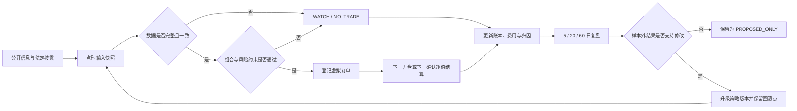

<p align="center">
  
</p>

<p align="center">
  
  
  
  
  
</p>

<p align="center">
  <a href="#实验命题">实验命题</a> ·
  <a href="#当前状态">当前状态</a> ·
  <a href="#决策流程">决策流程</a> ·
  <a href="#策略更新的准入条件">策略更新</a> ·
  <a href="#本地运行">本地运行</a> ·
  <a href="data/ledger/portfolio.json">虚拟账本</a>
</p>

> **一名金融 Agent，30,000 元虚拟资金；每次判断都要留下当时可见的证据。**

Vibe Finance 是一个面向中国大陆市场的虚拟投资研究项目。研究对象包括 A 股、场内 ETF 和中国公募基金。系统按固定时间收集公开信息，生成带时间戳的输入快照，再依次完成分析、风险检查、虚拟下单、成交结算和复盘。

写一段盘后分析并不难。难点在于让 Agent 长期承担可核对的决策责任：数据不足时停止交易；虚拟成交等待下一个可核验的价格时点；发生亏损后保留原始判断；修改策略前提供独立于调参过程的验证结果。仓库持续保存上述步骤的输入和输出。

> [!IMPORTANT]
> 项目不连接券商、支付系统或真实交易账户。全部订单、持仓和收益均为模拟结果，不构成投资建议，也不代表未来收益。

## 实验命题

Vibe Finance 关注四个可以持续检验的问题：

1. 当行情、公告或基金信息不完整时，Agent 能否主动放弃交易？
2. 股票、场内 ETF 与场外基金能否共享组合约束，同时使用各自正确的成交规则？
3. 每次决策能否按当时已经公开的信息重放，避免未来数据进入历史判断？
4. 策略调整能否经过预注册、走前检验和样本外比较，而非依据近期盈亏临时改动参数？

项目的评价对象因此不限于收益。数据冲突率、订单取消原因、费用、回撤、重复暴露、信号到成交的偏差，以及策略变更能否被回滚，都会进入后续复盘。

## 当前状态

以下数字取自仓库账本与策略配置，数据截点为 **2026-07-20（Asia/Shanghai）**。

| 项目 | 当前记录 | 说明 |
|---|---:|---|
| 初始项目资本 | ¥30,000 | 实验起始资金，后续不追溯修改 |
| 可投资虚拟现金 | ¥29,900 | 另有 ¥100 留作研究基础设施预算 |
| 当前持仓 | 0 | 尚无资产通过全部下单条件 |
| 待执行订单 | 0 | 账本中没有下一开盘或下一净值订单 |
| 基金研究池 | 20 只 | 覆盖宽基、成长、红利、行业、黄金、债券和现金管理 |
| 股票研究入口 | 动态 30 只 | 从沪深 300 与中证 500 成分股生成研究短名单 |
| 策略版本 | `0.2.0` | 策略变更必须保留旧版本与回滚基线 |
| DeepSeek 使用 | 0 次 / ¥0 | 预算余额采用用户提供的口径，尚未通过 API 核验 |

当前正式决策为 **`NO_TRADE`**。仓库只有两个交易日的快照，尚未满足 20 个不可变历史点的最低要求；部分原始数值来源、公司行为和基金申赎信息也未通过校验。流水线据此保持空仓，账本状态与现行规则一致。

当前证据可以从以下文件直接复核：

- [虚拟组合账本](data/ledger/portfolio.json)
- [2026-07-20 短周期机器报告](reports/daily/2026-07-20-short.json)
- [2026-07-20 收盘证据审计](reports/research/2026-07-20-close-audit.md)
- [策略配置](config/strategy.json)
- [股票与基金研究池](config/universe.json)

## 设计约束

项目先定义错误如何被阻止，再讨论资产如何选择。主要约束如下。

| 可能出现的问题 | 系统处理 | 可检查的记录 |
|---|---|---|
| 未来数据混入历史判断 | 输入必须带 `as_of`，且只能包含截点前已公开的信息 | `data/inbox/` 中的点时快照 |
| 收盘信号按同一收盘价成交 | 股票和 ETF 只能在更晚交易日按开盘数据结算 | `reports/execution/` 与订单日志 |
| 场外基金使用已知净值回填 | 申请后等待更晚公开的确认净值 | `PENDING_NEXT_NAV` 与基金结算报告 |
| 行情来源冲突或缺失 | 保留冲突原因，并阻止该资产生成新订单 | 日报中的 block / reason 字段 |
| 分红、拆分或复权处理不清 | 未处理的公司行为只能进入 `WATCH` 或 `HOLD` | 快照中的公司行为字段 |
| 多只产品重复同一风险暴露 | 同一 `exposure_group` 最多持有一个工具 | `config/universe.json` 与组合门禁 |
| 近期盈亏驱动参数追涨杀跌 | 策略候选先记录为 `PROPOSED_ONLY` | 进化报告、版本号与回滚基线 |

这些规则共同限定了系统能够声称什么。数据门禁通过，只表示输入具备计算条件；它并不自动产生买入结论。

## 决策流程



所有数值都要保存来源、发布时间和 `as_of`。价格至少需要两个独立来源。停复牌、公司行为、基金申赎、费率、净值日期或历史复权存在无法解释的缺口时，相关订单不会进入结算阶段。

### 不同资产使用不同的成交语义

| 资产 | 形成信号的时间 | 模拟成交时间 | 额外检查 |
|---|---|---|---|
| A 股 | 收盘后 | 更晚交易日的开盘时段 | ST/退市、停牌、涨跌停、财报、公司行为和流动性 |
| 场内 ETF | 收盘后 | 更晚交易日的开盘时段 | 折溢价、跟踪情况、规模、申赎、分红和交易单位 |
| 场外公募基金 | 申请判断时 | 申请日之后公开的确认净值 | 未知价、申赎限制、完整费率、基金经理、规模和持仓披露日期 |

天天基金用于发现基金线索并交叉检查净值、申赎、费率、规模、经理、持仓和公告。基金公司、交易所及法定披露仍是关键事实的确认来源。排行榜只参与候选发现，不直接触发订单。详细要求见 [天天基金使用规范](docs/TIANTIAN_FUND.md)。

## 组合约束

仓位管理由 [`config/strategy.json`](config/strategy.json) 统一执行。

| 约束 | 当前上限或下限 |
|---|---:|
| 实际持仓数量 | 最多 6 个 |
| 每轮新增买入 | 最多 2 个 |
| 单只股票目标权重 | 不超过 8% |
| 单只场内 ETF 目标权重 | 不超过 20% |
| 单只场外基金目标权重 | 不超过 15% |
| 全部权益风险资产 | 不超过组合的 60% |
| 现金 | 至少保留组合的 15% |
| 相同经济暴露 | 同一 `exposure_group` 最多一个工具 |

因此，持有沪深 300 ETF 后再买入同指数联接基金，不会被计作第二份分散。对 30,000 元规模的组合而言，交易单位和最低佣金也会限制小仓位数量。

## 策略更新的准入条件

周度反思任务先分析交易结果和数据质量，不直接修改策略。复盘至少覆盖以下内容：

1. 分别归因股票、场内 ETF、场外基金、黄金、债券和现金管理。
2. 在最近 5、20、60 个交易日上记录收益、回撤、波动、换手、费用和成交偏差。
3. 统计订单取消原因、来源冲突、公司行为错误、净值时点错误和重复暴露。
4. 将结论分为“有效”“无效”和“证据不足”，不使用模型自评替代统计结果。
5. 为每项候选修改预先写明假设、数据区间、评价指标、接受阈值、反证条件和回滚版本。

策略参数只有在以下条件同时成立时才能升级：至少完成 20 笔虚拟交易；走前测试通过；未参与调参的样本外结果优于当前版本；最大回撤没有恶化。其余修改只写入 `PROPOSED_ONLY`，等待后续数据验证。

历史输入、旧策略和失败结果均保留在仓库中。新版本可以推翻旧判断，但不能改写旧判断发生时所依据的信息。

## 定时运行

本地自动化按北京时间调度。

| 时间 | 周期 | 任务 |
|---|---|---|
| 08:00 | 工作日 | 核对隔夜公告、停复牌、公司行为和已有订单 |
| 09:35 | 工作日 | 结算上一收盘已经登记的虚拟订单，不生成新信号 |
| 16:30 | 工作日 | 保存收盘快照，分析股票与基金，生成下一时点决策 |
| 22:30 | 工作日 | 核验场外基金净值，处理待确认净值订单 |
| 每 6 小时 | 持续 | 只读检查心跳、账本和报告的新鲜度 |
| 周六 20:30 | 每周 | 归因交易结果，审查策略修改候选 |
| 周日 20:00 | 每周 | 汇总组合表现、来源质量和长期风险 |
| 23:10 | 每日 | 整理文档与日志，检查断链、重复和解析错误 |

任务收尾时，受控同步脚本会执行密钥扫描、JSON/JSONL 校验、测试、文件白名单检查、提交和远端 SHA 核验。相关设计见 [自动化说明](docs/AUTOMATION.md) 和 [GitHub 同步规则](docs/GITHUB_AUTOMATION.md)。

高频任务目前关闭。启用条件包括：许可明确的点时数据、成交与滑点模型、走前回测、独立样本外结果，以及再次人工确认。

## 信息来源与证据等级

来源按用途划分为三类。

- **A 级**：监管机构、交易所、法定披露、基金公司、指数公司和国家宏观机构。用于确认交易规则、公告、净值及其他关键事实。
- **B 级**：IMF、世界银行、BIS、OECD、可追溯研究机构和证券媒体。用于构建宏观情景并交叉核对事件。
- **C 级**：东方财富、天天基金、新浪财经等聚合渠道。用于发现线索和补充价格交叉检查。

报告会区分事实、推断、假设和 `UNKNOWN`。当同口径数据仍有冲突时，系统保留冲突记录并停止相关订单。专家观点用于补充情景分析，不能单独产生 `BUY` 或 `SELL`。完整规则见 [来源与证据规则](docs/SOURCES.md)。

## 本地运行

项目要求 Python 3.10+，运行时不依赖第三方包。

```bash
git clone https://github.com/ARC0127/Vibe-Finance.git
cd Vibe-Finance
python -m pip install -e .
python -m vibe_finance status
```

验证已有点时快照并运行短周期分析：

```bash
python -m vibe_finance validate --input data/inbox/2026-07-20.json
python -m vibe_finance run --input data/inbox/2026-07-20.json --mode short
```

其他命令：

```bash
python -m vibe_finance settle-open --input data/inbox/YYYY-MM-DD-open.json
python -m vibe_finance run-funds --input data/inbox/YYYY-MM-DD-funds.json
python -m vibe_finance record-api-cost --help
python -m unittest discover -s tests -v
```

同一日期的历史报告不会被常规运行覆盖。重复输入会触发不可变性检查。

## 如何复核一次决策

建议按以下顺序阅读：

1. 打开 [账本](data/ledger/portfolio.json)，确认现金、持仓和待执行订单。
2. 阅读 [当日决策报告](reports/daily/2026-07-20-short.md)，查看动作和阻断原因。
3. 回到 [当日输入快照](data/inbox/2026-07-20.json)，确认当时有哪些公开信息。
4. 对照 [策略配置](config/strategy.json)，定位触发的门禁和仓位限制。
5. 查看 [主研究 Prompt](MASTER_PROMPT.md)，核对任务边界和策略更新规则。
6. 运行 [流水线测试](tests/test_pipeline.py)，检查前视、费用、结算和不可变性约束。

这六类文件共同说明一项决策是如何形成的，也能定位它在哪个环节被阻止。

## 仓库结构

| 路径 | 内容 |
|---|---|
| [`vibe_finance/`](vibe_finance/) | 决策、订单、结算、账本和报告生成代码 |
| [`config/`](config/) | 策略参数、研究池和来源注册表 |
| [`data/inbox/`](data/inbox/) | 按日期保存的点时输入快照 |
| [`data/ledger/`](data/ledger/) | 组合、心跳、订单和 API 成本记录 |
| [`reports/`](reports/) | 日报、执行、研究、进化和自动化审计结果 |
| [`docs/`](docs/) | 证据、基金、自动化、参考项目和方法说明 |
| [`scripts/sync_github.sh`](scripts/sync_github.sh) | 受控的 GitHub `main` 同步脚本 |
| [`tests/`](tests/) | 前视偏差、费用、风险和不可变性测试 |

## 开发进度

- [x] 点时快照、不可覆盖日报和虚拟账本
- [x] 股票与 ETF 的下一开盘结算规则
- [x] 场外基金的下一确认净值规则
- [x] 费用、资产桶、重复暴露和市场冲击门禁
- [x] 自动化运行清单、密钥扫描和 `main` 同步
- [ ] 接入稳定且许可明确的 A 级数值数据源
- [ ] 积累首个满足门禁的 20 点历史窗口
- [ ] 完成首批虚拟成交及 5、20、60 日归因
- [ ] 验证首个策略修改候选
- [ ] 在数据许可、滑点模型和样本外检验通过后评估高频实验

## 常见问题

<details>
<summary><strong>为什么目前没有买入？</strong></summary>

当前只有两个交易日的快照，低于策略要求的 20 个历史点。部分原始数值来源、公司行为和基金交易字段也未完成校验，因此订单门禁没有通过。
</details>

<details>
<summary><strong>项目会给出真实投资建议吗？</strong></summary>

不会。系统只维护虚拟账本，不连接券商，也不会根据用户的真实资产、期限和风险承受能力提供个人化建议。
</details>

<details>
<summary><strong>为什么股票和基金不能共用一个成交模型？</strong></summary>

股票和场内 ETF 有交易所价格，可以按下一交易日的开盘数据模拟成交。场外基金通常按未知价原则申请，并在之后确认净值与份额。混用成交模型会造成错误定价或前视偏差。
</details>

<details>
<summary><strong>DeepSeek 是否参与决策？</strong></summary>

目前没有调用。预算只用于确有必要的中文材料结构化处理。任何实际调用都必须记录模型、用途、token、人民币成本和剩余预算，并且不能替代原始数据核验。
</details>

## 贡献与数据边界

欢迎提交可追溯的数据来源、复现问题、基金交易规则修正、风险门禁测试和文档改进。请勿提交 API 密钥、券商凭据、付费数据、验证码绕过方法，或许可状态不明的数据副本。

项目仍处于数据积累阶段。当前结果不足以证明策略有效，虚拟成交也无法覆盖实盘中的全部税费、流动性、涨跌停、停牌、申赎延迟和行为偏差。所有公开结果都应结合其时间截点、数据质量和模拟假设阅读。

<details>
<summary><strong>English summary</strong></summary>

Vibe Finance is an audit-first autonomous research loop for mainland China A-shares, exchange-traded funds, and Chinese public funds. It starts with CNY 30,000 of virtual capital and records point-in-time evidence, decisions, simulated orders, costs, portfolio state, and post-trade reviews.

The project is designed around a simple constraint: the agent may evolve, but it may not rewrite history. Strategy changes require preregistered hypotheses, walk-forward evaluation, untouched out-of-sample evidence, versioned configuration, and a rollback base. It never connects to a broker and is not investment advice.
</details>

---

<p align="center">
  <strong>让每次判断都能按当时的信息重新核对。</strong>
</p>
