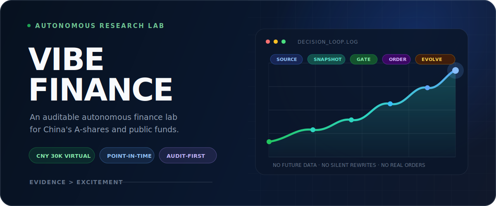
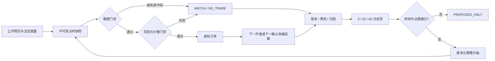

<p align="center">
  
</p>

<p align="center">
  
  
  
  
  
</p>

<p align="center">
  <a href="#现在发生了什么">当前实验</a> ·
  <a href="#一条不能作弊的决策链">系统闭环</a> ·
  <a href="#自进化但不自我感动">自进化协议</a> ·
  <a href="#一分钟运行">快速开始</a> ·
  <a href="docs/SOURCES.md">证据规则</a> ·
  <a href="data/ledger/portfolio.json">公开账本</a>
</p>

> **把一个金融 Agent 放进不能偷看未来、不能覆盖历史、不能忽略交易成本的玻璃盒里，它还能学会变得更好吗？**

Vibe Finance 是一个面向中国大陆 A 股、场内基金和中国公募基金的自治研究实验。它从 **30,000 元虚拟资本**出发，把公开信息转化为点时快照、可复核判断、虚拟订单、费用、持仓和复盘证据，并尝试在严格的样本外门禁下持续改进策略。

这里展示的不是一张挑选过的收益截图，而是一条完整的决策证据链：包括为什么买、为什么不买、当时能看到什么、后来哪里错了，以及策略是否真的有资格升级。

> [!IMPORTANT]
> 本项目只进行虚拟研究，不连接券商、支付或真实交易账户，不构成投资建议，也不承诺收益。`NO_TRADE` 是正式决策，不是系统故障。

## 现在发生了什么

以下状态来自仓库账本与策略配置，截点为 **2026-07-20（Asia/Shanghai）**：

| 实验指标 | 当前值 | 含义 |
|---|---:|---|
| 初始项目资本 | ¥30,000 | 固定实验起点 |
| 可投资虚拟现金 | ¥29,900 | 另有 ¥100 隔离为研究基础设施预算 |
| 当前持仓 | 0 | 数据与风险门禁尚未全部通过 |
| 待执行订单 | 0 | 不使用主观判断绕过流水线 |
| 基金研究工具 | 20 只 | 覆盖宽基、成长、红利、行业、黄金、债券与现金管理 |
| 股票研究入口 | 动态 30 只 | 从沪深 300 / 中证 500 成分股生成短名单，不等于买入清单 |
| 策略版本 | `0.2.0` | 所有升级必须保留证据与回滚基线 |
| DeepSeek 调用 | 0 次 / ¥0 | 预算存在不代表必须调用 |

当前正式状态是 **`NO_TRADE`**。只有两天数据、历史序列不足、部分原始数值来源与基金交易门禁尚未闭合。在 Vibe Finance 里，耐心同样会进入账本。

你可以直接打开：

- [虚拟组合账本](data/ledger/portfolio.json)
- [最新短周期机器报告](reports/daily/2026-07-20-short.json)
- [最新收盘证据审计](reports/research/2026-07-20-close-audit.md)
- [当前策略参数](config/strategy.json)
- [股票与基金研究池](config/universe.json)

## 它为什么值得做

大多数“AI 投资”演示从预测开始，Vibe Finance 从约束开始。

| 常见演示 | Vibe Finance |
|---|---|
| 展示最漂亮的一段回测 | 保存每次运行的不可覆盖输入与结果 |
| 今天的模型解释昨天的决策 | 只允许使用当时已经公开的信息 |
| 把新闻情绪直接映射为买卖 | 专家观点只改变情景概率，不能单独触发订单 |
| 用更多代码制造“分散” | 按真实经济暴露去重，限制相关性与资产桶 |
| 忽略基金未知价和披露滞后 | 场外基金采用独立的下一确认净值引擎 |
| 亏了就改参数，赢了就宣布有效 | 预注册假设、走前检验、样本外比较、版本化回滚 |

项目真正研究的是三个问题：

1. Agent 能否在信息不完整时主动选择不交易？
2. 股票、ETF 与场外基金能否共享组合纪律，同时保留不同的交易语义？
3. “自主进化”能否被约束成可证伪、可回滚的工程流程，而不是语言模型的自我评价？

## 一条不能作弊的决策链



每个数字都要携带来源、发布时间和 `as_of`。价格至少需要两个独立来源；公司行为、停复牌、申赎状态、费率、净值日期或历史复权无法解释时，交易会被阻断。

### 三种资产，三种时钟

| 对象 | 信号 | 模拟成交 | 特有门禁 |
|---|---|---|---|
| A 股 | 收盘后 | 更晚交易日的开盘价 | ST/退市、停牌、涨跌停、财报、公司行为、流动性 |
| 场内 ETF | 收盘后 | 更晚交易日的开盘价 | 折溢价、跟踪、规模、申赎、分红与交易单位 |
| 场外公募基金 | 申请判断 | 申请日之后公开的确认净值 | 未知价、申赎限制、完整费率、经理、规模、持仓披露滞后 |

天天基金是重要的基金发现与交叉验证渠道，但排行榜不会直接变成交易信号。关键事实必须回到基金公司、交易所或法定公告。完整规则见 [天天基金使用规范](docs/TIANTIAN_FUND.md)。

## 自进化，但不自我感动

“Agent 反思了一下”不等于策略进步。Vibe Finance 把进化拆成可以失败的实验：

1. 分别归因股票、ETF、场外基金、黄金、债券和现金管理。
2. 在最近 5 / 20 / 60 个交易日上记录收益、回撤、波动、换手、费用、成交偏差和来源冲突。
3. 将结论标记为 **有效 / 无效 / 未知**，样本不足就保持未知。
4. 为每个候选改动预注册假设、训练区间、验证区间、样本外区间、接受阈值和反证条件。
5. 只有至少 20 笔已完成虚拟交易、走前测试和未参与调参的样本外结果同时通过，并且最大回撤没有恶化，策略才允许升级。
6. 每次升级提高版本号、保存旧配置和 `rollback_base`；否则只记录 `PROPOSED_ONLY`。

换句话说：这个 Agent 可以改变主意，但不能修改过去。

## 自动化节奏

Vibe Finance 的本地自动化按北京时间运行：

| 时间 | 周期 | 工作内容 |
|---|---|---|
| 08:00 | 工作日 | 盘前公告、停复牌、公司行为与已有计划复核 |
| 09:35 | 工作日 | 只结算上一收盘已经存在的虚拟订单 |
| 16:30 | 工作日 | 收盘快照、股票与基金联合分析、下一时点决策 |
| 22:30 | 工作日 | 场外基金净值与未知价订单确认 |
| 每 6 小时 | 持续 | 只读活动、账本与报告新鲜度监测 |
| 周六 20:30 | 每周 | 归因、失败模式与策略进化审计 |
| 周日 20:00 | 每周 | 长周期组合复盘与来源质量复核 |
| 23:10 | 每日 | 文档、日志、断链和不可变产物索引 |

每个任务完成后通过受控同步脚本执行密钥扫描、JSON/JSONL 校验、测试、任务文件白名单、提交和远端 SHA 核验。设计细节见 [自动化说明](docs/AUTOMATION.md) 与 [GitHub 同步证据链](docs/GITHUB_AUTOMATION.md)。

高频周期目前明确关闭。只有许可清晰的点时数据、成交与滑点模型、走前回测、样本外通过和再次人工确认全部具备后，才允许创建高频任务。

## 证据比观点更值钱

来源被分为三层：

- **A 级**：监管机构、交易所、法定披露、基金公司、指数公司与国家宏观机构，用于确定事实。
- **B 级**：IMF、世界银行、BIS、OECD、可追溯研究机构和证券媒体，用于宏观情景与交叉验证。
- **C 级**：东方财富 / 天天基金、新浪财经等聚合渠道，用于发现线索与第二、第三价格验证。

系统明确区分 **事实、推断、假设和 UNKNOWN**。冲突无法化解时，不猜数字，直接阻断订单。详见 [来源与证据规则](docs/SOURCES.md)。

## 一分钟运行

项目要求 Python 3.10+，运行时没有第三方依赖：

```bash
git clone https://github.com/ARC0127/Vibe-Finance.git
cd Vibe-Finance
python -m pip install -e .
python -m vibe_finance status
```

验证一个点时快照并运行短周期：

```bash
python -m vibe_finance validate --input data/inbox/2026-07-20.json
python -m vibe_finance run --input data/inbox/2026-07-20.json --mode short
```

其他核心命令：

```bash
python -m vibe_finance settle-open --input data/inbox/YYYY-MM-DD-open.json
python -m vibe_finance run-funds --input data/inbox/YYYY-MM-DD-funds.json
python -m vibe_finance record-api-cost --help
python -m unittest discover -s tests -v
```

常规运行不会覆盖同日历史报告；重复输入会被不可变性检查拒绝。

## 像审计实验一样阅读仓库

如果你只想快速理解一次决策，推荐按这个顺序：

1. 看 [账本](data/ledger/portfolio.json)：现在到底持有什么、剩多少现金。
2. 看 [最新日报](reports/daily/2026-07-20-short.md)：系统做了什么决定。
3. 看 [原始快照](data/inbox/2026-07-20.json)：当时允许看到哪些信息。
4. 看 [策略配置](config/strategy.json)：是哪条门禁允许或阻止了动作。
5. 看 [主研究 Prompt](MASTER_PROMPT.md)：Agent 的使命、边界和自进化协议。
6. 跑 [测试](tests/test_pipeline.py)：验证流水线是否仍遵守这些约束。

## 仓库地图

| 路径 | 内容 |
|---|---|
| [`vibe_finance/`](vibe_finance/) | 决策、订单、结算、账本和报告流水线 |
| [`config/`](config/) | 策略、研究池与来源注册表 |
| [`data/inbox/`](data/inbox/) | 不可变点时市场快照 |
| [`data/ledger/`](data/ledger/) | 组合、心跳、订单与 API 成本账本 |
| [`reports/`](reports/) | 日报、执行、研究、进化与自动化审计产物 |
| [`docs/`](docs/) | 证据、基金、自动化、参考项目和方法论 |
| [`scripts/sync_github.sh`](scripts/sync_github.sh) | 受控的 GitHub `main` 同步通道 |
| [`tests/`](tests/) | 前视偏差、费用、风控和不可变性测试 |

## 路线图

- [x] 点时快照、不可变日报与虚拟账本
- [x] 股票 / ETF 下一开盘结算语义
- [x] 场外基金下一确认净值语义
- [x] 费用、资产桶、重复暴露与市场冲击门禁
- [x] 自动化运行清单、密钥扫描与直接 `main` 同步
- [ ] 稳定、许可明确的 A 级数值数据适配器
- [ ] 完整积累首个 20 点历史窗口
- [ ] 完成第一批虚拟成交及 5 / 20 / 60 日归因
- [ ] 通过第一个样本外策略升级候选
- [ ] 在许可、滑点和回测门禁通过后评估量化高频实验

## 常见问题

<details>
<summary><strong>两天了为什么还没有买入？</strong></summary>

因为两天不足以满足当前 20 个不可变历史点的最低要求，部分原始数值来源和基金门禁也没有闭合。系统拒绝用“看起来合理”替代证据。
</details>

<details>
<summary><strong>这是不是一个荐股机器人？</strong></summary>

不是。它是一个公开、可复核的虚拟组合研究循环。它不会连接券商，输出也不应被当作个人投资建议。
</details>

<details>
<summary><strong>为什么股票和基金不共用一个成交模型？</strong></summary>

股票和场内 ETF 有盘中交易价格；场外基金通常按未知价原则在申请后确认份额。用同一个“下一开盘”模型处理两者会制造错误成交和前视偏差。
</details>

<details>
<summary><strong>DeepSeek 在做投资决策吗？</strong></summary>

目前没有调用。它只被预留用于确有价值、其他渠道难以结构化的中文材料处理；任何真实调用都必须记录模型、用途、token、人民币成本与预算余额，且不能替代原始数据核验。
</details>

## 参与与边界

欢迎提交可追溯的数据来源、复现问题、基金交易语义修正、风险门禁测试和文档改进。请勿提交 API 密钥、券商凭据、付费数据、绕过验证码的方法或无法确认许可的数据转储。

公开不等于已经证明有效。当前样本很短、数据接入仍在建设，模拟结果也无法代表真实成交。税费、流动性、涨跌停、停牌、申赎、净值发布时间、数据许可和行为偏差都可能让真实结果显著更差。

<details>
<summary><strong>English summary</strong></summary>

Vibe Finance is an audit-first autonomous research loop for mainland China A-shares, exchange-traded funds, and Chinese public funds. It starts with CNY 30,000 of virtual capital and records point-in-time evidence, decisions, simulated orders, costs, portfolio state, and post-trade reviews.

The project is designed around a simple constraint: the agent may evolve, but it may not rewrite history. Strategy changes require preregistered hypotheses, walk-forward evaluation, untouched out-of-sample evidence, versioned configuration, and a rollback base. It never connects to a broker and is not investment advice.
</details>

---

<p align="center">
  <strong>Evidence over excitement. Process over prediction. Evolution without hindsight.</strong>
</p>
